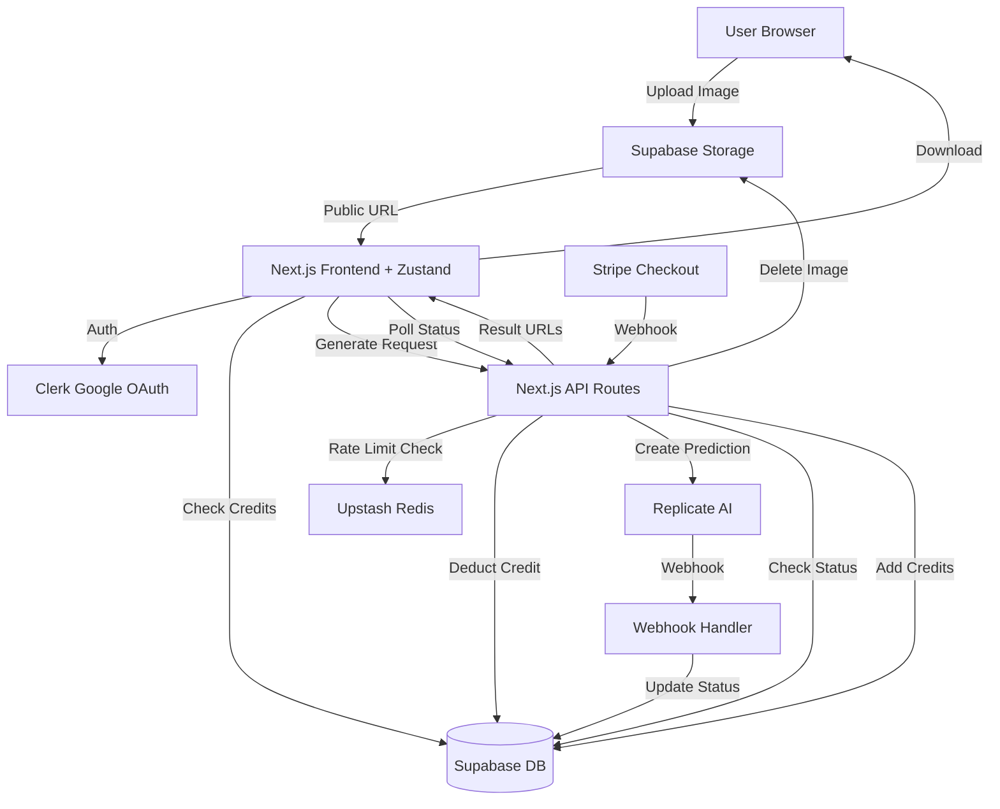

# Magic Room - Full Stack Implementation Plan
Primary Purple: #8B5CF6
Light Purple: #A855F7
Dark Purple: #7C3AED
White: #FFFFFF

## Architecture Overview



## Phase 1: Project Foundation & Configuration

**1.1 Initialize Next.js Project**

- Create Next.js 15+ with App Router, TypeScript, Tailwind CSS v4
- Configure `pnpm` workspace with strict TypeScript settings
- Set up folder structure: `app/`, `components/`, `lib/`, `types/`, `hooks/`, `stores/`
- Install Zustand for state management (user credits, active generation, theme)

**1.2 Documentation & Rules**

- Create `AGENTS.md` (max 80 lines) with:
    - Tech stack overview
    - Data flow (upload → process → display → discard)
    - Key API endpoints and their purposes
    - Privacy guarantees (ephemeral processing)
    - AI model info (rocketdigitalai/interior-design-sdxl-lightning)

- Create `.cursor/rules/general.mdc` with:
    - TypeScript strict rules (no `any`, explicit types)
    - Naming conventions (PascalCase components, camelCase functions, UPPER_SNAKE_CASE constants)
    - Component structure order (imports → types → component → exports)
    - Tech lead guidelines for code reviews

**## Rewritten 1.3 Environment Setup**


**1.3 Environment Setup**

- Create `.env.example` (template) and `.env.local` (development) with all required keys
- Prefix client-side variables with `NEXT_PUBLIC_`

**Required Environment Variables:**
- **Clerk**: `NEXT_PUBLIC_CLERK_PUBLISHABLE_KEY`, `CLERK_SECRET_KEY`
- **Supabase**: `NEXT_PUBLIC_SUPABASE_URL`, `NEXT_PUBLIC_SUPABASE_ANON_KEY`, `SUPABASE_SERVICE_ROLE_KEY`
- **Replicate**: `REPLICATE_API_TOKEN`, `REPLICATE_WEBHOOK_SECRET`
- **Stripe**: `STRIPE_SECRET_KEY`, `STRIPE_WEBHOOK_SECRET`, `NEXT_PUBLIC_STRIPE_PUBLISHABLE_KEY`
- **Upstash Redis**: `UPSTASH_REDIS_REST_URL`, `UPSTASH_REDIS_REST_TOKEN`

## Phase 2: Database & Auth Setup

**2.1 Supabase Schema**

Create tables and storage bucket:

```sql
-- users table
CREATE TABLE users (
  id UUID PRIMARY KEY DEFAULT gen_random_uuid(),
  clerk_user_id TEXT UNIQUE NOT NULL,
  email TEXT NOT NULL,
  credits INTEGER NOT NULL DEFAULT 1,
  created_at TIMESTAMP DEFAULT NOW(),
  updated_at TIMESTAMP DEFAULT NOW()
);

-- transactions table
CREATE TABLE transactions (
  id UUID PRIMARY KEY DEFAULT gen_random_uuid(),
  user_id UUID REFERENCES users(id) ON DELETE CASCADE,
  type TEXT NOT NULL, -- 'purchase', 'usage', 'bonus'
  amount INTEGER NOT NULL,
  stripe_payment_id TEXT,
  metadata JSONB,
  created_at TIMESTAMP DEFAULT NOW()
);

-- credit_packages table
CREATE TABLE credit_packages (
  id TEXT PRIMARY KEY,
  name TEXT NOT NULL,
  credits INTEGER NOT NULL,
  price_cents INTEGER NOT NULL,
  stripe_price_id TEXT NOT NULL,
  active BOOLEAN DEFAULT true
);

-- generations table (for webhook tracking)
CREATE TABLE generations (
  id TEXT PRIMARY KEY, -- Replicate prediction ID
  user_id UUID REFERENCES users(id) ON DELETE CASCADE,
  status TEXT NOT NULL, -- 'starting', 'processing', 'succeeded', 'failed', 'canceled'
  image_path TEXT NOT NULL, -- Supabase Storage path
  output_urls TEXT[], -- Array of result URLs
  error TEXT,
  created_at TIMESTAMP DEFAULT NOW(),
  completed_at TIMESTAMP
);
```

**Storage Setup:**
- Create public bucket: `room-images`
- Set lifecycle policy: auto-delete files after 2 hours
- Allow public read access (temporary URLs)

**2.2 Clerk Integration**

- Install `@clerk/nextjs`
- Wrap app with `ClerkProvider` in `app/layout.tsx`
- Create middleware for protected routes
- Build webhook handler at `app/api/webhooks/clerk/route.ts` to sync user creation to Supabase
- Award 1 free credit on first sign-up

## Phase 3: Core Types & Utilities

**3.1 TypeScript Types** (`types/index.ts`)

```typescript
type RoomType = "living-room" | "bedroom" | "kitchen" | "bathroom" | "dining-room" | "office" | "gaming-room";
type Theme = "modern" | "minimalist" | "scandinavian" | "industrial" | "tropical" | "bohemian" | "vintage" | "luxury";

interface DesignOptions {
  roomType: RoomType;
  theme: Theme;
  customPrompt?: string;
  imageUrl: string;
}

interface GenerationResult {
  id: string;
  status: "starting" | "processing" | "succeeded" | "failed";
  outputUrls?: string[];
  error?: string;
}

interface User {
  id: string;
  clerkUserId: string;
  email: string;
  credits: number;
}
```

**3.2 Utility Functions**

- `lib/supabase.ts`: Server-side Supabase client
- `lib/supabase-client.ts`: Client-side Supabase client for uploads
- `lib/replicate.ts`: Replicate API wrapper
- `lib/redis.ts`: Upstash Redis rate limiter
- `lib/stripe.ts`: Stripe checkout session creator
- `lib/prompt-builder.ts`: Dynamic prompt engineering based on room type and theme

**3.3 Zustand Stores**

- `stores/user-store.ts`: User credits, refresh function
- `stores/generation-store.ts`: Active generation state, polling control

## Phase 4: UI Foundation (shadcn/ui + Custom Components, magic-ui)

**4.1 Install shadcn/ui**

- Initialize shadcn/ui with Tailwind v4
- Install components: `button`, `card`, `dialog`, `dropdown-menu`, `slider`, `toast`, `badge`, `skeleton`
- Customize `components.json` with purple theme colors

**Image Optimization:**
- Use Next.js Image component with lazy loading
- Implement react-lazyload for result grids
- Add skeleton loaders during image loads
- Progressive image loading (blur placeholder)

**4.2 Layout & Theme**

- `app/layout.tsx`: Root layout with ClerkProvider, ThemeProvider, Toaster
- `components/theme-provider.tsx`: next-themes for light/dark mode
- `components/header.tsx`: Logo, theme toggle, credits display, sign-in button
- `components/footer.tsx`: Links and attribution

**4.3 Landing Page** (`app/page.tsx`)

- Hero section with CTA
- Features grid (privacy-first, instant results, 4-8 variations)
- Pricing cards (1 free + paid packs)
- "Try It Now" button → redirect to `/generate`

## Phase 5: Core Generation Flow

**5.1 Upload Component** (`components/room-uploader.tsx`)

- Use `react-dropzone` for drag-and-drop upload
- Integrate `react-image-crop` for cropping (optional)
- Validation: max 10MB, accepted formats (jpg, png, webp)
- Upload directly to Supabase Storage bucket `room-images`
- Generate public URL and store in Zustand state
- Show upload progress with toast notifications

**5.2 Options Panel** (`components/design-options.tsx`)

- Room type selector (dropdown or card grid)
- Theme selector (visual cards with preview images)
- Optional custom prompt textarea
- "Generate Designs" button (disabled if no image or insufficient credits)

**5.3 Generation API** (`app/api/generate/route.ts`)

```typescript
// 1. Validate auth (Clerk)
// 2. Rate limit check (Upstash Redis: 5 requests per hour per user)
// 3. Validate input (Zod schema)
// 4. Check user credits in Supabase (must have ≥1)
// 5. Build dynamic prompt with room-specific details
// 6. Call Replicate API: rocketdigitalai/interior-design-sdxl-lightning
//    - Include webhook URL: https://yourdomain.com/api/webhooks/replicate
// 7. Deduct 1 credit on successful prediction start
// 8. Create generation record in Supabase
// 9. Return prediction ID
```

**5.4 Polling Endpoint** (`app/api/generate/[id]/route.ts`)

- Check generation status from Supabase DB (updated by webhook)
- If not found or stale, fallback: fetch from Replicate API directly
- Return current status + output URLs when ready
- Frontend polls with backoff: 2s → 5s → 10s intervals

**5.5 Replicate Webhook** (`app/api/webhooks/replicate/route.ts`)

- Verify webhook signature with `REPLICATE_WEBHOOK_SECRET`
- Update generation record in Supabase with status and outputs
- If failed: refund 1 credit to user (create transaction)
- If succeeded: delete uploaded image from Supabase Storage (privacy)
- Return 200 OK to acknowledge webhook

**5.6 Results Display** (`components/results-viewer.tsx`)

- Before/after comparison slider (react-compare-image or custom)
- Grid view of all variations (4-8 images)
- Download buttons for each result (client-side download, no server storage)
- "Generate Again" button
- Poll generation status using Zustand store

## Phase 6: Credits & Payments

**6.1 Credit Packages Seeding**

Insert packages into Supabase (after creating Stripe products):

```typescript
const packages = [
  { id: "starter", name: "Starter Pack", credits: 30, price_cents: 999 },
  { id: "pro", name: "Pro Pack", credits: 150, price_cents: 1999 },
  { id: "ultimate", name: "Ultimate Pack", credits: 300, price_cents: 2999 },
];
```

**6.2 Purchase Flow** (`app/api/checkout/route.ts`)

- Create Stripe checkout session for selected package
- Redirect user to Stripe-hosted page
- Success/cancel URLs

**6.3 Stripe Webhook** (`app/api/webhooks/stripe/route.ts`)

- Verify webhook signature
- On `checkout.session.completed`: add credits to user in Supabase
- Create transaction record

**6.4 Credits Display**

- `components/credits-badge.tsx`: Show current credits in header
- `app/purchase/page.tsx`: Credits purchase page with package cards

## Phase 7: Polish & Privacy

**7.1 Animations**

- Install Framer Motion
- Add page transitions, button hover effects, image fade-ins
- Loading states with skeleton loaders and progress indicators

**7.2 Privacy Enforcement**

- Supabase Storage auto-deletes files after 2 hours (lifecycle policy)
- Webhook deletes uploaded image after successful generation
- Manual cleanup cron job (Edge Function) for orphaned files
- Replicate output URLs expire automatically (48 hours)
- Clear Zustand state on generation completion
- Add privacy policy page (`app/privacy/page.tsx`)

**7.3 Error Handling**

- Global error boundary
- API error responses with proper status codes
- User-friendly error messages in UI
- Retry logic for transient failures

## Phase 8: Testing & Deployment

**8.1 Environment Variables**

- Verify all keys are set in Vercel/deployment platform
- Test webhook endpoints with Stripe CLI

**8.2 Rate Limiting**

- Test Upstash Redis limits per IP and per user
- Adjust thresholds as needed (e.g., 10 requests/hour for free users, 50 for paid)
-  Vercel Analytics for performance
**8.3 Deployment Checklist**


- Build succeeds with `pnpm build`
- All API routes return proper responses
- Clerk auth flow works end-to-end
- Stripe webhooks are registered (use Stripe CLI for testing)
- Replicate webhook URL is configured in Replicate dashboard
- Supabase Storage bucket `room-images` is public with 2hr lifecycle
- Supabase RLS policies allow public read, authenticated write

## Key Files to Create

- `AGENTS.md` - AI agent reference (tech stack, flows, privacy)
- `.cursor/rules/general.mdc` - Code style + tech lead guidelines
- `package.json` - Dependencies with pnpm
- `next.config.js` - Optimize images, env validation
- `tailwind.config.ts` - Purple theme, dark mode
- `middleware.ts` - Clerk auth + rate limiting
- `lib/constants.ts` - ROOM_TYPES, THEMES, CREDIT_PACKAGES, POSITIVE_PROMPT, NEGATIVE_PROMPT
- `lib/prompt-builder.ts` - Dynamic prompt engineering
- `lib/supabase.ts`, `lib/supabase-client.ts`, `lib/replicate.ts`, `lib/redis.ts`, `lib/stripe.ts`
- `stores/user-store.ts`, `stores/generation-store.ts` - Zustand stores
- `components/ui/*` - shadcn components
- `app/page.tsx` - Landing page
- `app/generate/page.tsx` - Main generation interface
- `app/purchase/page.tsx` - Buy credits
- `app/api/generate/route.ts` - Start generation
- `app/api/generate/[id]/route.ts` - Poll status
- `app/api/checkout/route.ts` - Stripe checkout
- `app/api/webhooks/clerk/route.ts` - User sync
- `app/api/webhooks/stripe/route.ts` - Payment confirmation
- `app/api/webhooks/replicate/route.ts` - Generation completion/failure

## Recommended AI Model

**rocketdigitalai/interior-design-sdxl-lightning** on Replicate:

- Fast generation (lightning model)
- SDXL-based for photorealistic quality
- Built-in ControlNet for layout preservation
- Supports batch predictions (4-8 variations)
- Proven track record for interior design tasks

Alternative: **youzu/stable-interiors-v2** if more diversity needed, or **adirik/interior-design** for stronger layout preservation with segmentation.