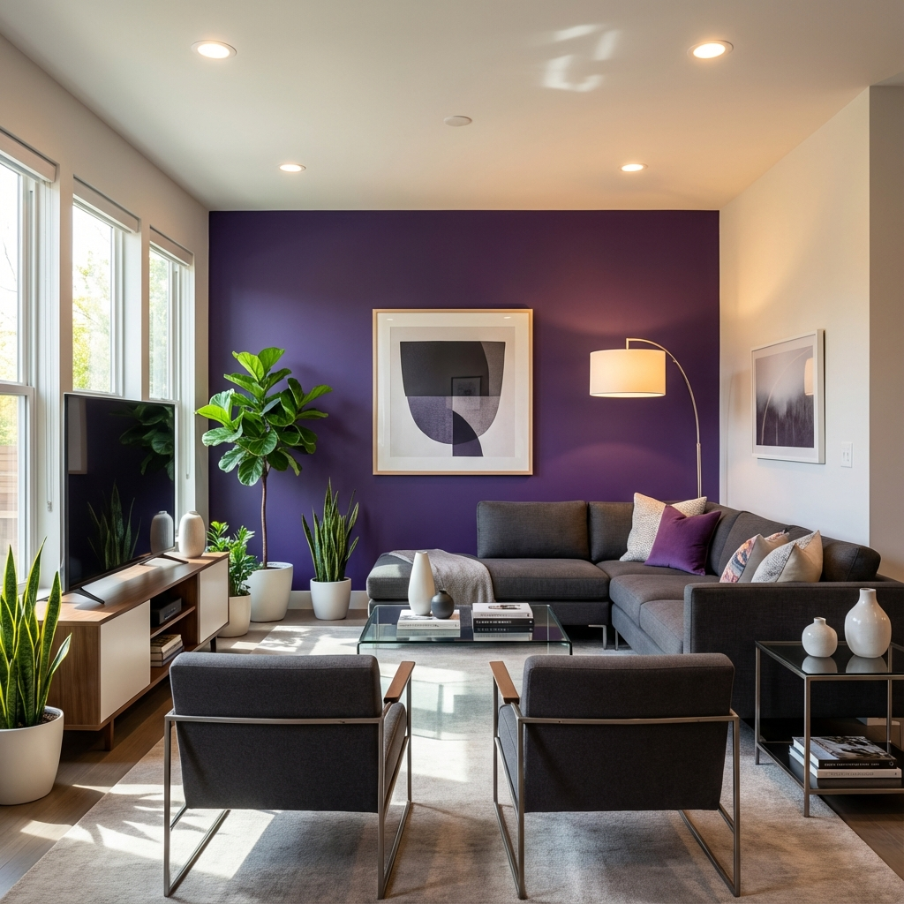

<div align="center">

<h1>✨ Magic Room ✨</h1>

[](https://nextjs.org/)
[](https://react.dev/)
[](https://www.typescriptlang.org/)
[](https://tailwindcss.com/)
[](https://ui.shadcn.com/)
[](https://supabase.com/)
[](https://www.postgresql.org/)
[](https://clerk.com/)
[](https://openrouter.ai/)
[](https://stripe.com/)
[](https://upstash.com/)
[](https://pnpm.io/)
[](LICENSE)
[](https://github.com/ThanosKa/magic-room/stargazers)
[](CONTRIBUTING.md)

<p>AI-powered interior design assistant that transforms your room photos into stunning design variations using Google's Gemini Vision model. Upload a room image, choose your style, and get professional design suggestions instantly.</p>

[Report Bug](https://github.com/ThanosKa/magic-room/issues/new?template=bug_report.md) · [Request Feature](https://github.com/ThanosKa/magic-room/issues/new?template=feature_request.md) · [Discussions](https://github.com/ThanosKa/magic-room/discussions)

</div>

---

## 📸 Screenshots

<div align="center">
  
  
</div>

---

## Table of Contents

- [About](#about)
- [Features](#features)
  - [SEO and Performance](#seo-and-performance)
  - [Enhanced UX](#enhanced-ux)
- [Demo](#demo)
- [How It Works](#how-it-works)
- [Built With](#built-with)
- [Getting Started](#getting-started)
  - [Prerequisites](#prerequisites)
  - [Installation](#installation)
  - [Environment Setup](#environment-setup)
  - [Database Setup](#database-setup)
  - [Run Locally](#run-locally)
  - [Testing](#testing)
  - [SEO Check](#seo-check)
- [Usage](#usage)
- [Project Structure](#project-structure)
- [Architecture](#architecture)
- [Deployment](#deployment)
  - [Deploy to Vercel](#deploy-to-vercel)
  - [Manual Deploy](#manual-deploy)
  - [Production Checklist](#production-checklist)
- [CI](#ci)
- [Contributing](#contributing)
- [Security](#security)
- [Acknowledgments](#acknowledgments)
- [Star History](#star-history)
- [Contact](#contact)
- [Support](#support)
- [License](#license)
- [Back to Top](#back-to-top)

---

## About

Magic Room is an AI-powered interior design assistant that helps anyone transform their living spaces. Upload a photo of your room, select a design theme, and get instant professional design suggestions powered by Google's Gemini Vision model. With a transparent credit system, secure authentication, and privacy-first approach, redesigning your space has never been easier.

## Features

- **Instant AI Design Generation**: Upload any room photo and get multiple design variations in seconds
- **Multiple Design Themes**: Choose from Bohemian, Industrial, Minimalist, Modern, Scandinavian, and Tropical styles
- **Credit-Based System**: Start with free credits, purchase packs that never expire
- **Before/After Comparison**: Interactive slider to compare original and redesigned rooms
- **Privacy-First**: Images processed in-memory only, never stored on servers
- **Real-Time Generation**: Synchronous processing with live status updates
- **Design History**: View and revisit all your previous design generations
- **Responsive Design**: Works seamlessly on desktop and mobile devices

### SEO and Performance

- Next.js Metadata API for dynamic Open Graph and Twitter cards
- Core Web Vitals optimization for fast loading
- SEO audit script (`pnpm seo:audit`) for content quality checks
- Optimized images and Tailwind v4 for minimal bundle size
- App Router for improved performance and SEO

### Enhanced UX

- Smooth page transitions and loading states
- Drag-and-drop image upload with validation
- Animated buttons and interactive elements
- Accessible forms with keyboard navigation
- Clear progress indicators during AI processing
- Responsive layouts for all screen sizes

## Demo

- Run locally with `pnpm dev` at `http://localhost:3000`
- Deploy to Vercel with one-click deployment and configure environment variables

Quick preview: Upload room photo → Select design theme → AI generates variations → Compare with slider → Download results

## How It Works

1. User uploads a room image via drag-and-drop (converted to base64 client-side)
2. User selects room type and design theme, optionally adds custom prompt
3. System validates authentication and credit balance
4. Image is sent to OpenRouter's Google Gemini Vision model for processing
5. AI generates design variations and returns results immediately
6. Credits are deducted and generation metadata is stored
7. User can compare designs with before/after slider and download results

## Built With

| Category          | Technology                                              |
| ----------------- | ------------------------------------------------------- |
| Framework         | Next.js 15 (App Router)                                 |
| Language          | TypeScript (strict)                                     |
| Styling           | Tailwind CSS v4 + shadcn/ui                             |
| State Management  | Zustand                                                 |
| Auth              | Clerk                                                   |
| Database          | Supabase (PostgreSQL)                                   |
| AI Model          | Google Gemini 2.5 Flash (via OpenRouter)                |
| Rate Limiting     | Upstash Redis                                           |
| Payments          | Stripe                                                  |
| Validation        | Zod                                                     |
| Logging           | Pino                                                    |
| Hosting           | Vercel                                                  |

## Getting Started

### Prerequisites

- Node.js 20+
- pnpm
- Accounts: Clerk, Supabase, Stripe, OpenRouter, Upstash Redis

### Installation

```bash
git clone https://github.com/ThanosKa/magic-room.git
cd magic-room
pnpm install
```

### Environment Setup

```bash
cp .env.example .env.local
# Fill in the following variables:
# Clerk: NEXT_PUBLIC_CLERK_PUBLISHABLE_KEY, CLERK_SECRET_KEY
# Supabase: NEXT_PUBLIC_SUPABASE_URL, SUPABASE_SERVICE_ROLE_KEY, SUPABASE_ANON_KEY
# Stripe: STRIPE_SECRET_KEY, STRIPE_WEBHOOK_SECRET, NEXT_PUBLIC_STRIPE_PUBLISHABLE_KEY, STRIPE_PRICE_IDS
# OpenRouter: OPENROUTER_API_KEY
# Upstash Redis: UPSTASH_REDIS_REST_URL, UPSTASH_REDIS_REST_TOKEN
# App: NEXT_PUBLIC_APP_URL
```

### Database Setup

Run the Supabase migrations:

```bash
# Apply migrations from supabase/migrations/
# Or run the SQL files in order through your Supabase dashboard
```

### Run Locally

```bash
pnpm dev
# Visit http://localhost:3000
```

### Testing

- `pnpm lint` — ESLint quality checks
- `pnpm type-check` — TypeScript compilation check
- `pnpm test:run` — Run Vitest test suite
- `pnpm test:coverage` — Run tests with coverage report

### SEO Check

```bash
# Terminal 1
pnpm dev

# Terminal 2
pnpm seo:audit
```

Optionally target a deployed URL:

```bash
NEXT_PUBLIC_APP_URL=https://your-domain.com pnpm seo:audit
```

## Usage

1. Sign up or sign in with Clerk authentication
2. Upload a photo of your room via drag-and-drop
3. Select your room type and preferred design theme
4. Optionally add custom design instructions
5. Click "Generate Designs" (requires available credits)
6. Wait 30-60 seconds for AI processing
7. Compare results with the before/after slider
8. Download your favorite design variations
9. View your design history in your account

## Project Structure

```
magic-room/
├── app/                    # Next.js App Router pages and API routes
│   ├── api/               # API endpoints (generate, checkout, webhooks)
│   ├── generate/          # Main generation page
│   └── pricing/           # Pricing page
├── components/            # Reusable UI components
│   ├── ui/               # shadcn/ui components
│   └── ...               # Custom components
├── lib/                  # Utility libraries and configurations
│   ├── openrouter.ts     # AI model integration
│   ├── stripe.ts         # Payment processing
│   └── supabase.ts       # Database client
├── stores/               # Zustand state management
├── supabase/             # Database migrations and seed data
├── tests/                # Test files
└── .github/              # GitHub configuration
```

## Architecture

- **App Router**: Next.js 15 App Router for routing and API endpoints
- **Authentication**: Clerk middleware for session management
- **Credit System**: Atomic operations in Supabase with non-expiring credits
- **AI Processing**: Synchronous OpenRouter API calls with Google Gemini Vision
- **Privacy**: Images processed in-memory only, no persistent storage
- **Rate Limiting**: Upstash Redis for abuse prevention (100 generations/hour per user)
- **State Management**: Zustand for client-side state (credits, generation status)
- **Validation**: Zod schemas for type-safe API validation
- **Logging**: Structured logging with Pino

## Deployment

### Deploy to Vercel

The easiest way to deploy Magic Room is with Vercel:

1. Push your code to GitHub
2. Import the project in Vercel
3. Add all environment variables from `.env.local`
4. Update `NEXT_PUBLIC_APP_URL` to your production domain
5. Deploy

[](https://vercel.com/new/clone?repository-url=https%3A%2F%2Fgithub.com%2FThanosKa%2Fmagic-room)

### Manual Deploy

Build locally and run on Node 20+:

```bash
pnpm build
pnpm start
```

### Production Checklist

- [ ] Configure production environment variables
- [ ] Set up Supabase connection pooling
- [ ] Configure Clerk production instance and webhooks
- [ ] Enable Stripe live mode with webhook endpoints
- [ ] Set up Upstash Redis production instance
- [ ] Configure custom domain and SSL
- [ ] Enable error tracking and monitoring
- [ ] Test all payment flows and webhooks
- [ ] Verify AI model integration works in production

## CI

`.github/workflows/ci.yml` runs automated checks on every push and pull request:
- ESLint for code quality
- TypeScript type checking
- Vitest test suite execution
- Uses Node.js 20 and pnpm for consistency

## Contributing

Contributions are welcome! Please read [CONTRIBUTING.md](CONTRIBUTING.md) and follow our [Code of Conduct](CODE_OF_CONDUCT.md). Use the issue templates for bugs and features, and the PR template when submitting changes.

## Security

Report security vulnerabilities privately as described in [SECURITY.md](SECURITY.md). Do not file public issues for security concerns.

## Acknowledgments

- [Google Gemini](https://gemini.google.com/) for the AI vision model
- [OpenRouter](https://openrouter.ai/) for API access
- [shadcn/ui](https://ui.shadcn.com) for beautiful UI components
- [Vercel](https://vercel.com) for hosting and deployment
- [Next.js](https://nextjs.org/) for the framework

## Star History

<div align="center">

[](https://star-history.com/#ThanosKa/magic-room&Date)

</div>

## Contact

- GitHub Issues: [Open an issue](https://github.com/ThanosKa/magic-room/issues)
- X: [@KazakisThanos](https://x.com/KazakisThanos)
- Email: kazakis.th@gmail.com

## Support

[](https://buymeacoffee.com/thaka)

## License

Licensed under Apache License 2.0. See [LICENSE](LICENSE).

---

<div id="back-to-top" align="center">

[Back to Top](#readme)

</div>
